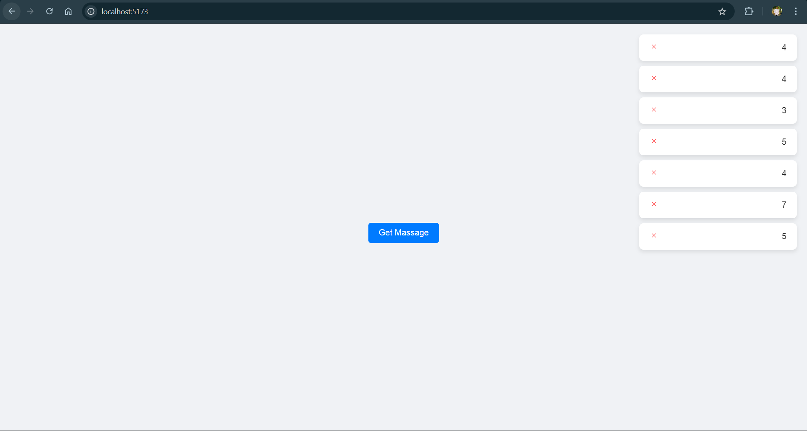

# React + Vite Setup and Toast Notification Demo

This project is set up with Vite, providing a modern development experience with fast refresh and optimized build times. Additionally, this project includes a demo showcasing how toast notifications work in React.

## Toast Notification Demo

This demo demonstrates a simple toast notification system implemented in React. Toast notifications are temporary messages that appear on the screen to provide feedback or alerts to the user. In this example, you can see how to:

- **Add New Toasts**: Click the "Get Massage" button to create a new toast notification.
- **Automatic Removal**: Each toast notification will automatically disappear after 5 seconds.
- **Manual Removal**: Click the close icon to remove a toast notification manually.

### Demo Screenshot

Below is a screenshot showing the toast notifications in action:

## Getting Started

To get started with this setup and see the toast notifications in action, follow these steps:

1. **Clone the Repository**: `git clone <https://github.com/Ayush1350/Toast_Notifications.git>`
2. **Install Dependencies**: `npm install` or `yarn install`
3. **Run the Development Server**: `npm run dev` or `yarn dev`
4. **Open Your Browser**: Navigate to `http://localhost:5173` (or the port specified by Vite) to see the demo.

For detailed instructions on how to use and configure the plugins, refer to their respective documentation linked above.

## Created By

This project was created by **Ayush Patel**.